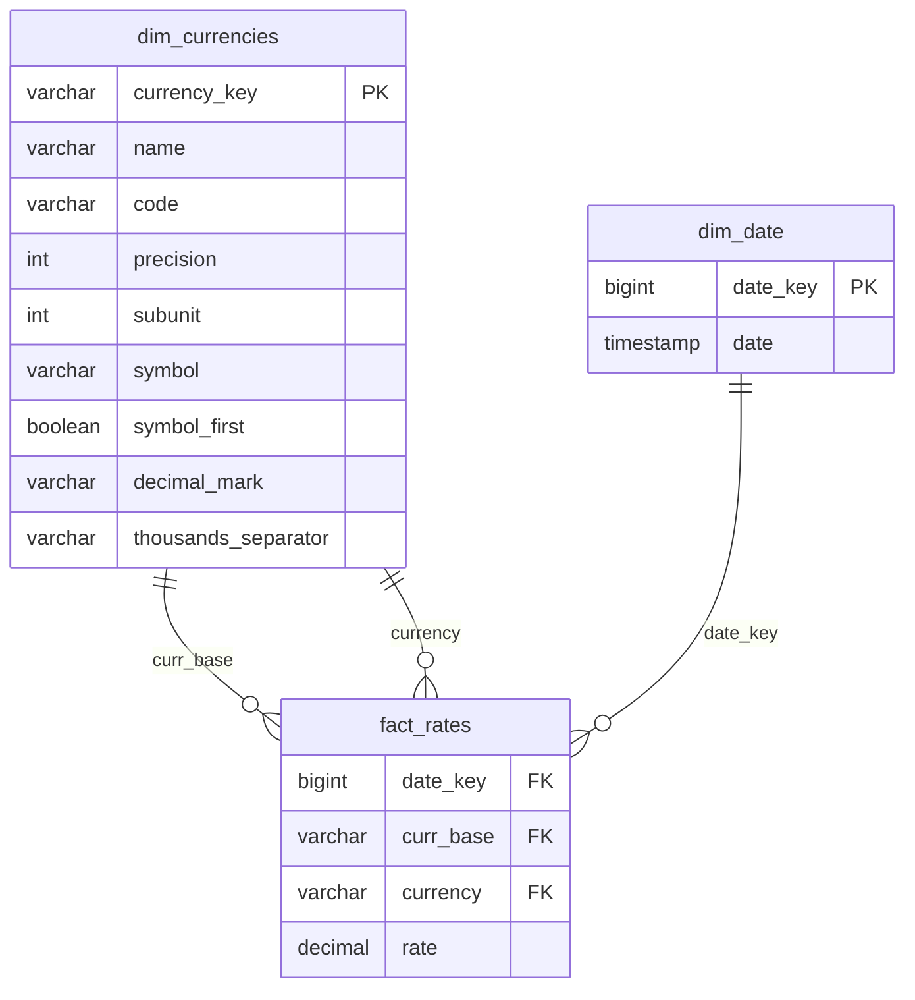

# Gold Layer — Data Model

```mermaid
erDiagram
    dim_currencies {
        varchar currency_key PK
        varchar name
        varchar code
        int precision
        int subunit
        varchar symbol
        boolean symbol_first
        varchar decimal_mark
        varchar thousands_separator
    }
    dim_date {
        bigint date_key PK
        timestamp date
    }
    fact_rates {
        bigint date_key FK
        varchar curr_base FK
        varchar currency FK
        decimal rate
    }
    dim_currencies ||--o{ fact_rates : "curr_base"
    dim_currencies ||--o{ fact_rates : "currency"
    dim_date ||--o{ fact_rates : "date_key"
```
