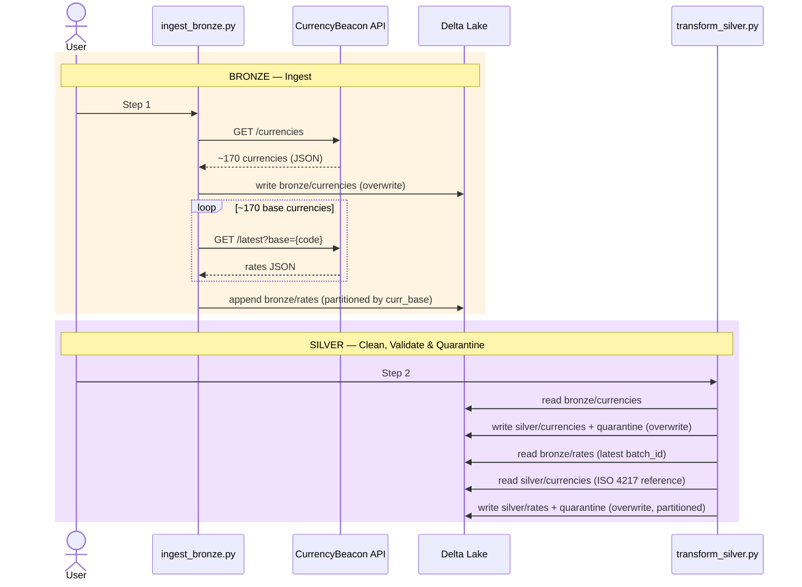
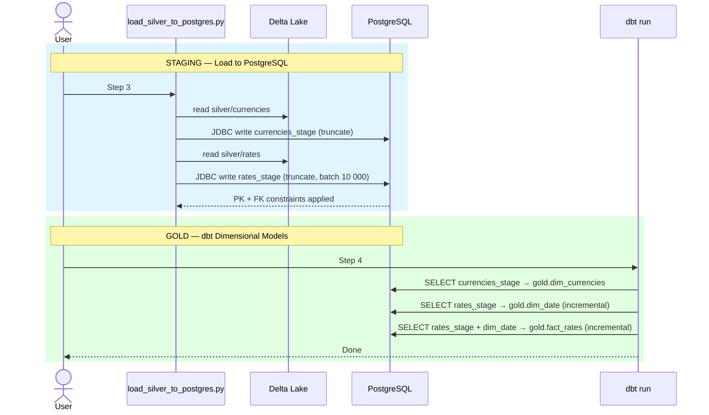

# ETL Sequence

## Part 1 — Ingest & Transform

```mermaid
sequenceDiagram
    actor User
    participant IB as ingest_bronze.py
    participant API as CurrencyBeacon API
    participant DL as Delta Lake
    participant TS as transform_silver.py

    rect rgb(255, 244, 225)
        Note over User,DL: BRONZE — Ingest
        User->>IB: Step 1
        IB->>API: GET /currencies
        API-->>IB: ~170 currencies (JSON)
        IB->>DL: write bronze/currencies (overwrite)
        loop ~170 base currencies
            IB->>API: GET /latest?base={code}
            API-->>IB: rates JSON
        end
        IB->>DL: append bronze/rates (partitioned by curr_base)
    end

    rect rgb(240, 225, 255)
        Note over User,TS: SILVER — Clean, Validate & Quarantine
        User->>TS: Step 2
        TS->>DL: read bronze/currencies
        TS->>DL: write silver/currencies + quarantine (overwrite)
        TS->>DL: read bronze/rates (latest batch_id)
        TS->>DL: read silver/currencies (ISO 4217 reference)
        TS->>DL: write silver/rates + quarantine (overwrite, partitioned)
    end
```

## Part 2 — Load & Gold

```mermaid
sequenceDiagram
    actor User
    participant LP as load_silver_to_postgres.py
    participant DL as Delta Lake
    participant PG as PostgreSQL
    participant DBT as dbt run

    rect rgb(225, 245, 255)
        Note over User,PG: STAGING — Load to PostgreSQL
        User->>LP: Step 3
        LP->>DL: read silver/currencies
        LP->>PG: JDBC write currencies_stage (truncate)
        LP->>DL: read silver/rates
        LP->>PG: JDBC write rates_stage (truncate, batch 10 000)
        PG-->>LP: PK + FK constraints applied
    end

    rect rgb(225, 255, 225)
        Note over User,PG: GOLD — dbt Dimensional Models
        User->>DBT: Step 4
        DBT->>PG: SELECT currencies_stage → gold.dim_currencies
        DBT->>PG: SELECT rates_stage → gold.dim_date (incremental)
        DBT->>PG: SELECT rates_stage + dim_date → gold.fact_rates (incremental)
        DBT-->>User: Done
    end
```
