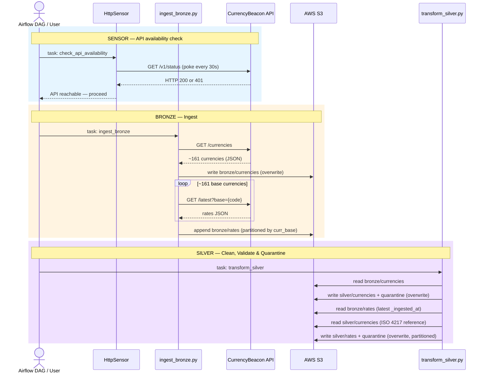
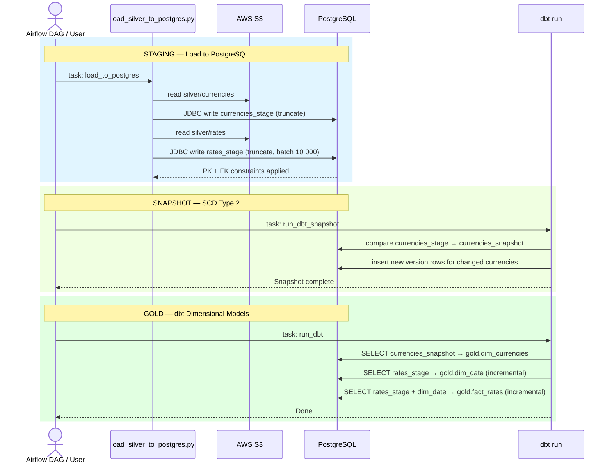

# ETL Sequence

> Steps are orchestrated by the Airflow DAG (`currency_pipeline`). Each task runs in a fresh `pipeline-spark` container spawned via DockerOperator. The manual equivalent is shown in the README under Option A / Option B.

## Part 1 — Ingest & Transform

## Part 2 — Load & Gold

