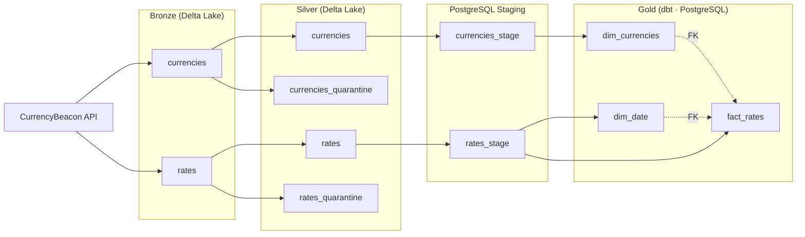

# Pipeline Architecture

```mermaid
flowchart LR
    API["CurrencyBeacon API"]

    subgraph Bronze["Bronze (Delta Lake)"]
        BC[currencies]
        BR[rates]
    end

    subgraph Silver["Silver (Delta Lake)"]
        SC[currencies]
        SQ1[currencies_quarantine]
        SR[rates]
        SQ2[rates_quarantine]
    end

    subgraph Staging[PostgreSQL Staging]
        CS[currencies_stage]
        RS[rates_stage]
    end

    subgraph Gold["Gold (dbt · PostgreSQL)"]
        DC[dim_currencies]
        DD[dim_date]
        FR[fact_rates]
    end

    API --> BC
    API --> BR
    BC --> SC
    BC --> SQ1
    BR --> SR
    BR --> SQ2
    SC --> CS
    SR --> RS
    CS --> DC
    RS --> DD
    RS --> FR
    DC -.->|FK| FR
    DD -.->|FK| FR
```
