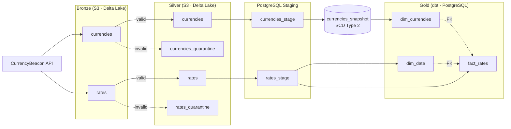

# Pipeline Architecture

```mermaid
flowchart LR
    API["CurrencyBeacon API"]

    subgraph Bronze["Bronze (S3 · Delta Lake)"]
        BC[currencies]
        BR[rates]
    end

    subgraph Silver["Silver (S3 · Delta Lake)"]
        SC[currencies]
        SQ1[currencies_quarantine]
        SR[rates]
        SQ2[rates_quarantine]
    end

    subgraph Staging["PostgreSQL Staging"]
        CS[currencies_stage]
        RS[rates_stage]
    end

    SNAP[("currencies_snapshot\nSCD Type 2")]

    subgraph Gold["Gold (dbt · PostgreSQL)"]
        DC[dim_currencies]
        DD[dim_date]
        FR[fact_rates]
    end

    API --> BC
    API --> BR
    BC -->|valid| SC
    BC -.->|invalid| SQ1
    BR -->|valid| SR
    BR -.->|invalid| SQ2
    SC --> CS
    SR --> RS
    CS --> SNAP --> DC
    RS --> DD
    RS --> FR
    DC -.->|FK| FR
    DD -.->|FK| FR
```
