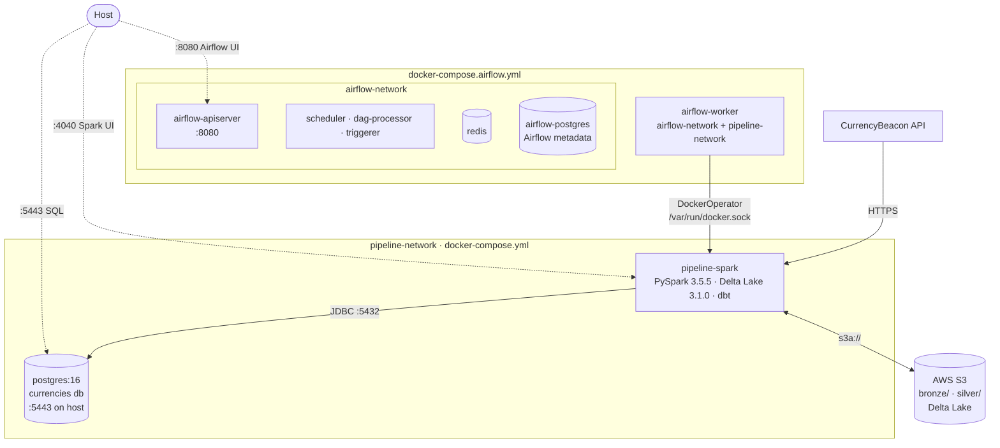
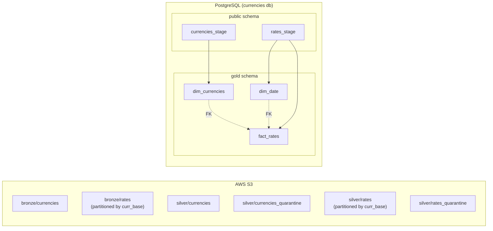

# System Architecture

## Services & Networks

> The Airflow worker bridges both networks — it receives tasks via `airflow-network` and spawns fresh `pipeline-spark` containers that join `pipeline-network` (where `postgres` is reachable by hostname).

## Data Layer Overview

