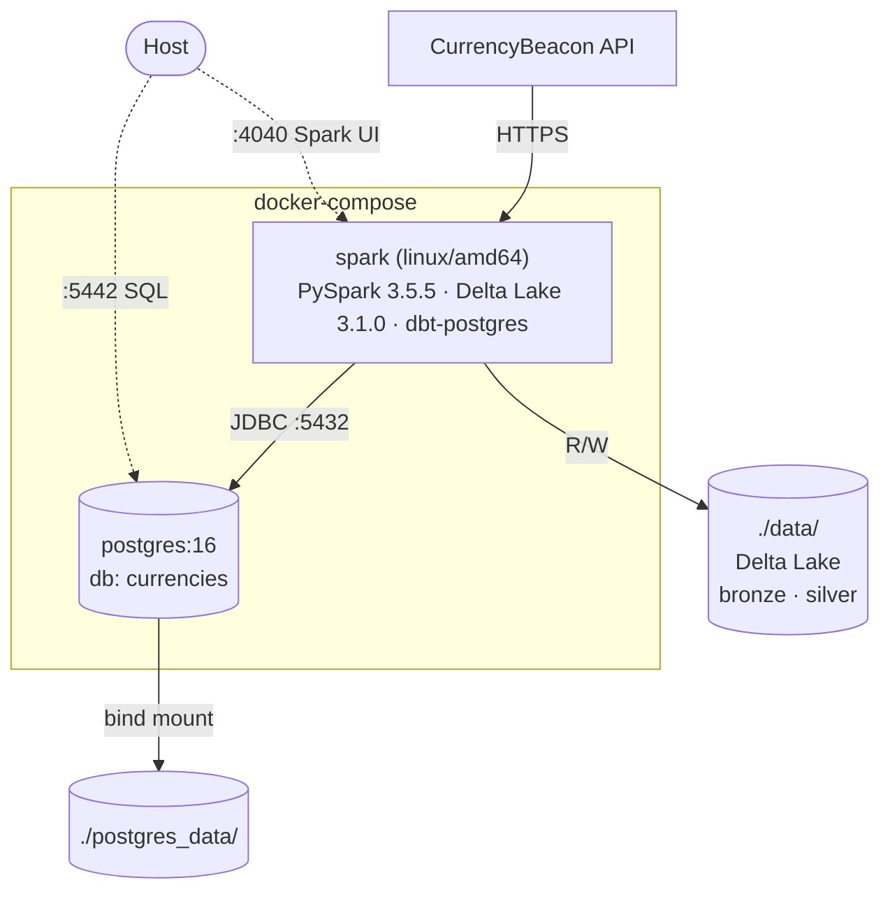
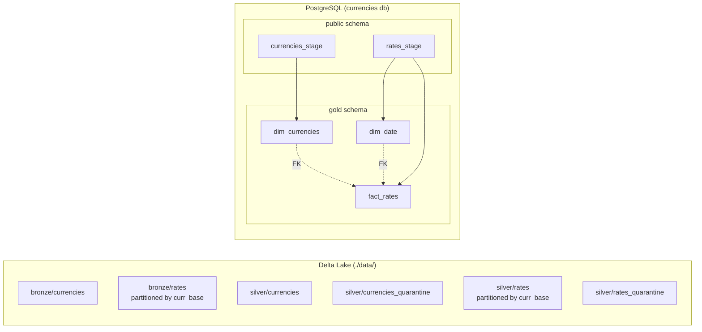

# System Architecture

## Services & Connections

```mermaid
flowchart TB
    API["CurrencyBeacon API"]

    subgraph compose["docker-compose"]
        SPARK["spark (linux/amd64)<br/>PySpark 3.5.5 · Delta Lake 3.1.0 · dbt-postgres"]
        PG[("postgres:16<br/>db: currencies")]
        SPARK -->|"JDBC :5432"| PG
    end

    DL[("./data/<br/>Delta Lake<br/>bronze · silver")]
    PGVOL[("./postgres_data/")]

    HOST(["Host"])

    API -->|HTTPS| SPARK
    SPARK -->|"R/W"| DL
    PG -->|"bind mount"| PGVOL
    HOST -.->|":4040 Spark UI"| SPARK
    HOST -.->|":5442 SQL"| PG
```

## Data Layer Overview

```mermaid
flowchart LR
    subgraph delta["Delta Lake  (./data/)"]
        direction TB
        B1[bronze/currencies]
        B2[bronze/rates<br/>partitioned by curr_base]
        S1[silver/currencies]
        S2[silver/currencies_quarantine]
        S3[silver/rates<br/>partitioned by curr_base]
        S4[silver/rates_quarantine]
    end

    subgraph pg["PostgreSQL  (currencies db)"]
        direction TB
        subgraph staging[public schema]
            ST1[currencies_stage]
            ST2[rates_stage]
        end
        subgraph gold[gold schema]
            G1[dim_currencies]
            G2[dim_date]
            G3[fact_rates]
        end
    end

    ST1 --> G1
    ST2 --> G2
    ST2 --> G3
    G1 -.->|FK| G3
    G2 -.->|FK| G3
```
