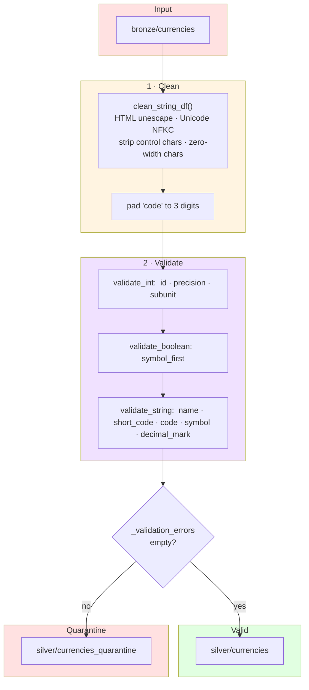
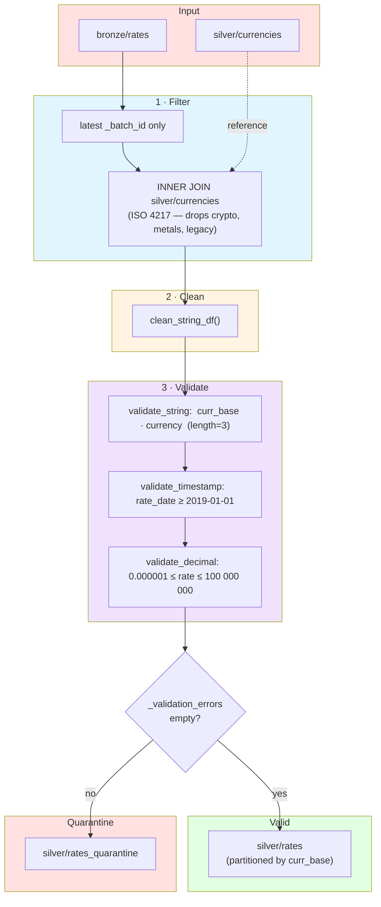
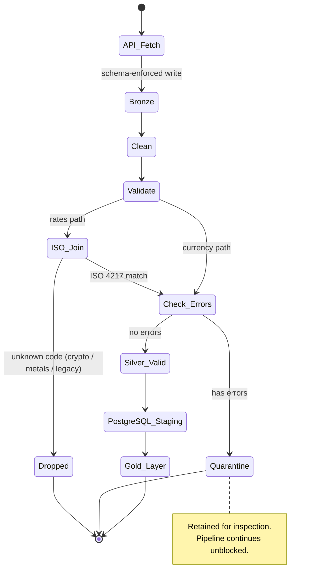

# Silver Layer — Validation & Quarantine

## Currency Validation

```mermaid
flowchart TD
    subgraph Input["Input"]
        BC[bronze/currencies]
    end

    subgraph Clean["1 · Clean"]
        CC["clean_string_df()<br/>HTML unescape · Unicode NFKC<br/>strip control chars · zero-width chars"]
        CP["pad 'code' to 3 digits"]
        CC --> CP
    end

    subgraph Validate["2 · Validate"]
        VI["validate_int:  id · precision · subunit"]
        VB["validate_boolean:  symbol_first"]
        VS["validate_string:  name · short_code · code · symbol · decimal_mark"]
        VI --> VB --> VS
    end

    CHK{"_validation_errors<br/>empty?"}

    subgraph Valid["Valid"]
        SC[silver/currencies]
    end

    subgraph Quarantine["Quarantine"]
        SCQ[silver/currencies_quarantine]
    end

    BC --> CC
    CP --> VI
    VS --> CHK
    CHK -->|yes| SC
    CHK -->|no| SCQ

    style Input fill:#ffe1e1
    style Clean fill:#fff4e1
    style Validate fill:#f0e1ff
    style Valid fill:#e1ffe1
    style Quarantine fill:#ffe1e1
```

## Rate Validation

```mermaid
flowchart TD
    subgraph Input["Input"]
        BR[bronze/rates]
        SC2[silver/currencies]
    end

    subgraph Filter["1 · Filter"]
        RF["latest _batch_id only"]
        RJ["INNER JOIN silver/currencies<br/>(ISO 4217 — drops crypto, metals, legacy)"]
        RF --> RJ
    end

    subgraph Clean["2 · Clean"]
        RC["clean_string_df()"]
    end

    subgraph Validate["3 · Validate"]
        VRS["validate_string:  curr_base · currency  (length=3)"]
        VRT["validate_timestamp:  rate_date ≥ 2019-01-01"]
        VRD["validate_decimal:  0.000001 ≤ rate ≤ 100 000 000"]
        VRS --> VRT --> VRD
    end

    CHK{"_validation_errors<br/>empty?"}

    subgraph Valid["Valid"]
        SR["silver/rates<br/>(partitioned by curr_base)"]
    end

    subgraph Quarantine["Quarantine"]
        SRQ[silver/rates_quarantine]
    end

    BR --> RF
    SC2 -.->|reference| RJ
    RJ --> RC --> VRS
    VRD --> CHK
    CHK -->|yes| SR
    CHK -->|no| SRQ

    style Input fill:#ffe1e1
    style Filter fill:#e1f5ff
    style Clean fill:#fff4e1
    style Validate fill:#f0e1ff
    style Valid fill:#e1ffe1
    style Quarantine fill:#ffe1e1
```

## Record-Level Data Flow

```mermaid
stateDiagram-v2
    [*] --> API_Fetch

    API_Fetch --> Bronze : schema-enforced write

    Bronze --> Clean
    Clean --> Validate

    Validate --> ISO_Join : rates path
    Validate --> Check_Errors : currency path

    ISO_Join --> Check_Errors : ISO 4217 match
    ISO_Join --> Dropped : unknown code (crypto / metals / legacy)

    Check_Errors --> Silver_Valid : no errors
    Check_Errors --> Quarantine : has errors

    Silver_Valid --> PostgreSQL_Staging
    PostgreSQL_Staging --> Gold_Layer

    Gold_Layer --> [*]
    Quarantine --> [*]
    Dropped --> [*]

    note right of Quarantine
        Retained for inspection.
        Pipeline continues unblocked.
    end note
```
